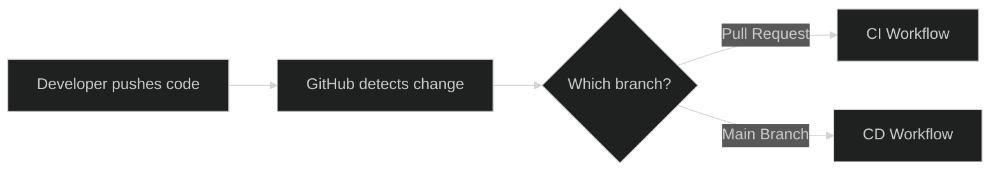
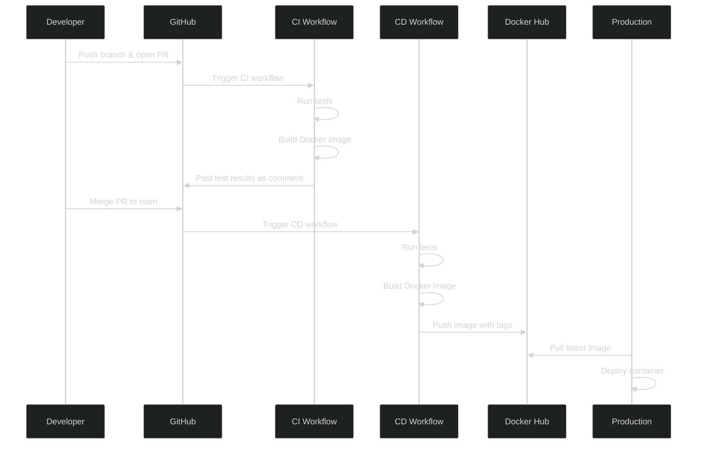

# CI/CD with GitHub Actions

In this lab, we'll build a complete CI/CD pipeline for a simple FastAPI application using GitHub Actions. When you open a pull request, GitHub Actions will automatically run your tests, build your Docker image, and report the results back as a comment. When you merge to main, it will build and push your Docker image to Docker Hub, making it available for deployment anywhere (which makes this a Continuous Delivery instead of Continuous Deployment).

By the end of this lab, you'll have a better understanding of how industry teams automate their software delivery pipelines starting from pull requests to deployment ready images.

## Prerequisites

You'll need to first sign up for a Docker Hub account at <https://hub.docker.com>.

## Provided Code

Take a look through the provided code:

```text
cicd-lab/
├── app/
│   ├── __init__.py
│   └── main.py          # FastAPI application
├── tests/
│   ├── __init__.py
│   └── test_main.py     # Pytest tests
├── Dockerfile           # Container definition
├── pyproject.toml       # Python dependencies (uv)
└── README.md
```

This should be a familiar setup that uses `uv` and Docker. The FastAPI application we've provided is a simple "echo" webserver. It has two endpoints GET `/echo` and GET `/echo/<name>` that return `Hello, World!` or `Hello, <name>!`. Importantly, we've included a new folder `tests/` that implements unit tests using `pytest`. These will be used for our CI.

## Understanding the CI/CD Workflow

Before we dive into implementation, let's understand what we're building:



**Continuous Integration (CI)** runs on every pull request:

- Runs tests
- Reports results back to the PR
- Builds the Docker image

**Continuous Deployment (CD)** runs when code merges to main, which should effectively only ever be after a PR lands:

- Runs tests
- Builds the Docker image
- Pushes the image to Docker Hub

## Part 1: Testing Locally

Before we automate anything, let's verify our application works locally.

```bash
# build the docker image
docker build -t echo-api:local .
# run the container
docker run -d -p 8000:8000 --name echo-api echo-api:local
# test the endpoints
curl http://localhost:8000/echo
curl http://localhost:8000/echo/Student
```

You should see the output:

```bash
{"message":"Hello, World!"}
{"message":"Hello, Student!"}
```

**Run the tests:**

Now, let's run the pytest suite. First, install dependencies locally:

```bash
uv sync
```

Then run pytest:

```bash
uv run pytest -v
```

Pytest will automatically look for any tests in our directory and execute them. The `-v` is simply to print verbose output. You can read more about [pytest at its documentation](https://docs.pytest.org/en/stable/index.html) if you're interested. You should see something like:

```bash
tests/test_main.py::test_echo PASSED
tests/test_main.py::test_echo_name PASSED

====== 2 passed in 0.24s ======
```

**Clean up:**

```bash
docker stop echo-api
docker rm echo-api
```

Great! Now that we know everything works locally, let's automate this with GitHub Actions.

## Part 2: Creating the CI Workflow

GitHub Actions workflows are defined in YML files under `.github/workflows/`. This is the beauty of GitHub Actions, we don't need to spin up any additional infrastructure to run our CI/CD pipelines, GitHub handles all of it for us automatically based on the files we define! Otherwise, you would need to spin up various pieces of infrastructure, such as nodes to watch the repository and worker nodes to execute each step in the pipelines.

Let's create our first workflow. First, create the github workflow directory:

```bash
mkdir -p .github/workflows
```

Then, create a file `.github/workflows/ci.yml` and put the following inside:

```yml
name: CI - Pull Request Checks

on:
  pull_request:
    branches: [ main ]

jobs:
  test:
    runs-on: ubuntu-latest

    steps:
      - name: Checkout code
        uses: actions/checkout@v5

      - name: Install uv
        uses: astral-sh/setup-uv@v6

      - name: Install project
        run: uv sync --locked --all-extras --dev

      - name: Run unit tests
        run: uv run pytest -v

      - name: Build Docker image
        run: docker build -t echo-api:test .
```

Let's break down what this workflow does:

**Trigger**: This is the `on:` object. Runs automatically when a pull request targets the main branch.

**Job**: Defines a single job `test:`. Runs on GitHub's Ubuntu runners (free for public repos). This job has multiple steps:

1. **Checkout code**: Gets your repository code using an action provided by GitHub
2. **Install uv**: Installs uv using an action provided by Astral
3. **Install project**: Runs uv sync to install dependencies for our project
4. **Run unit tests**: Runs pytest to execute unit tests
5. **Build Docker image**: Builds image using Docker

If you're interested, the [workflow syntax documentation](https://docs.github.com/en/actions/reference/workflows-and-actions/workflow-syntax) may be helpful in understanding what's happening exactly as well as what is possible.

**Commit and push this workflow:**

```bash
git add .github/workflows/ci.yml
git commit -m "Add CI workflow for pull requests"
git push origin main
```

By pushing this to our repository, we've effectively deployed our GitHub workflow!

## Part 3: Testing the CI Workflow

Now let's see our CI in action. We'll create a pull request and watch GitHub Actions work.

**Create a new branch:**

```bash
git checkout -b add-health-endpoint
```

**Add a health check endpoint to `app/main.py`:**

```python
@app.get("/health")
def health():
    return {"status": "healthy"}
```

**Add a test for the new endpoint in `tests/test_main.py`:**

```python
def test_health():
    response = client.get("/health")
    assert response.status_code == 200
    assert response.json() == {"status": "healthy"}
```

**Commit and push:**

```bash
git add app/main.py tests/test_main.py
git commit -m "Add health check endpoint"
git push origin add-health-endpoint
```

**Create a pull request:**

- Go to your repository on GitHub
- Click "Pull requests" → "New pull request"
- Select your `add-health-endpoint` branch
- Click "Create pull request"

GitHub provides a nice UI to watch our workflow run. You should see a window in your PR that shows the status of the workflow being executed. You can click into this to get the exact logs that happened at each step of our workflow, which is great for debugging when your tests fail!

Although, wouldn't it be even nicer to see the test results directly in the PR? Let's add that.

## Part 4: Adding PR Comments with Test Results

We'll enhance our CI workflow to post test results as a comment on the PR. This gives reviewers immediate visibility into what passed or failed.

**Update `.github/workflows/ci.yml`:**

```yml
name: CI - Pull Request Checks

on:
  pull_request:
    branches: [ main ]

permissions:
  contents: read
  pull-requests: write

jobs:
  test:
    runs-on: ubuntu-latest

    steps:
      - name: Checkout code
        uses: actions/checkout@v5

      - name: Install uv
        uses: astral-sh/setup-uv@v6

      - name: Install project
        run: uv sync --locked --all-extras --dev

      - name: Run tests and capture output
        id: pytest
        run: |
          set +e  # Don't exit on failure
          uv run pytest -v --tb=short > test_output.txt 2>&1
          TEST_EXIT_CODE=$?
          echo "exit_code=$TEST_EXIT_CODE" >> $GITHUB_OUTPUT
          cat test_output.txt
          exit $TEST_EXIT_CODE

      - name: Post test results to PR
        if: always()
        uses: actions/github-script@v7
        with:
          script: |
            const fs = require('fs');
            const testOutput = fs.readFileSync('test_output.txt', 'utf8');
            const exitCode = '${{ steps.pytest.outputs.exit_code }}';
            const status = exitCode === '0' ? '✅ All tests passed!' : '❌ Tests failed';

            const body = `## ${status}

            <details>
            <summary>Test Results</summary>

            \`\`\`
            ${testOutput}
            \`\`\`

            </details>`;

            github.rest.issues.createComment({
              owner: context.repo.owner,
              repo: context.repo.repo,
              issue_number: context.issue.number,
              body: body
            });

      - name: Build Docker image
        run: |
          docker build -t echo-api:test .
```

**What changed?**

1. **Permissions**: Added `pull-requests: write` so the workflow can comment on PRs.
2. **Run tests step**: Now captures output to a file and stores the exit code.
3. **Post results step**: Uses GitHub's script action to post a formatted comment with test results.
4. **if: always()**: Ensures the comment is posted even if tests fail. Otherwise, any steps after a step fails will not run.

**Commit and push the update:**

```bash
git checkout add-health-endpoint
git add .github/workflows/ci.yml
git commit -m "Add test results commenting to CI"
git push origin add-health-endpoint
```

Go back to your PR and watch the new workflow run. When it completes, you should see a comment appear with your test results!

## Part 5: Setting up CD

Before we can push images to Docker Hub, we need to do some configuration to get GitHub Actions a token to use.

**Create a Docker Hub access token:**

1. Log in to <https://hub.docker.com>
2. Go to "Account Settings" and click "Personal access tokens" on the left
3. Click "Generate new token"
4. Name it something like "github-actions" and give it "Read & Write" permissions
5. Create the token and **copy the token** (you won't see it again)

**Add secrets to your GitHub repository:**

1. Go to your GitHub repo → "Settings" → "Secrets and variables" → "Actions"
2. Click "New repository secret"
3. Add `DOCKER_USERNAME` with your Docker Hub username
4. Add `DOCKER_TOKEN` with the access token you just created

**Create a repository on Docker Hub:**

1. Go to "Repositories" → "Create Repository"
2. Name it `echo-api` (or whatever you prefer)
3. Set visibility to "Public"
4. Click "Create"

These secrets are encrypted and only available to your workflows. Never commit credentials to your repository!

## Part 6: Creating the CD Workflow

Now let's create a separate workflow (CD) that runs when code is merged to main. This will build and push our Docker image to Docker Hub, which should ultimately represent a production ready image.

**Create `.github/workflows/cd.yml`:**

```yml
name: CD - Deploy to Docker Hub

on:
  push:
    branches: [ main ]

jobs:
  build-and-push:
    runs-on: ubuntu-latest

    steps:
      - name: Checkout code
        uses: actions/checkout@v5

      - name: Install uv
        uses: astral-sh/setup-uv@v6

      - name: Install project
        run: uv sync --locked --all-extras --dev

      - name: Run unit tests
        run: uv run pytest -v

      - name: Log in to Docker Hub
        uses: docker/login-action@v3
        with:
          username: ${{ secrets.DOCKER_USERNAME }}
          password: ${{ secrets.DOCKER_TOKEN }}

      - name: Build and push Docker image
        uses: docker/build-push-action@v5
        with:
          context: .
          push: true
          tags: ${{ secrets.DOCKER_USERNAME }}/echo-api:latest
```

This workflow begins quite similarly to what we have defined for our CI workflow. Namely, we install uv and dependencies, then run tests. However, then, we additionally login and push our Docker image to the Docker Hub repository we created. Note how we use secrets, GitHub Actions makes it easy for us to reference the secrets that we created earlier!

**Commit the CD workflow:**

```bash
git checkout main
git add .github/workflows/cd.yml
git commit -m "Add CD workflow for Docker Hub deployment"
git push origin main
```

## Part 7: Watching the Full Pipeline

Now let's see the complete CI/CD pipeline in action!

**Merge your pull request:**

- Go to your PR on GitHub
- Click "Merge pull request"
- Confirm the merge

This will land your change onto the main branch, which should trigger the CD workflow we just created. You can go to the "Actions" tab on your repository to view the status of the job. You should see a job being executed (or already executed) that has the same name as the PR you merged. When it finishes, navigate to the repository you created on Docker Hub and you should now see an image there! Note that anyone can now pull and run your image since your repository is public.

## Recap

The life-cycle of code in this particular setup would be as follows:



## Additional Resources

- [GitHub Actions Documentation](https://docs.github.com/en/actions)
- [Docker Build Push Action](https://github.com/docker/build-push-action)
- [FastAPI Testing Guide](https://fastapi.tiangolo.com/tutorial/testing/)
- [Semantic Versioning](https://semver.org/)
